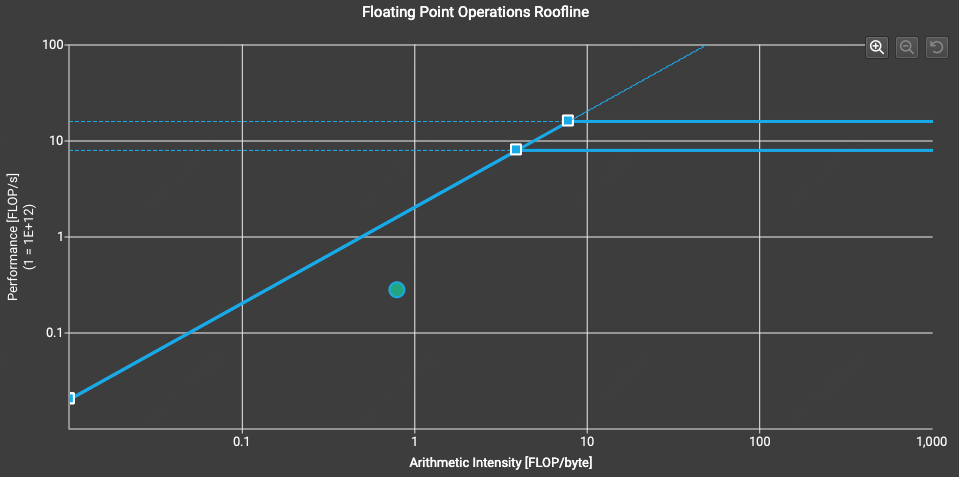
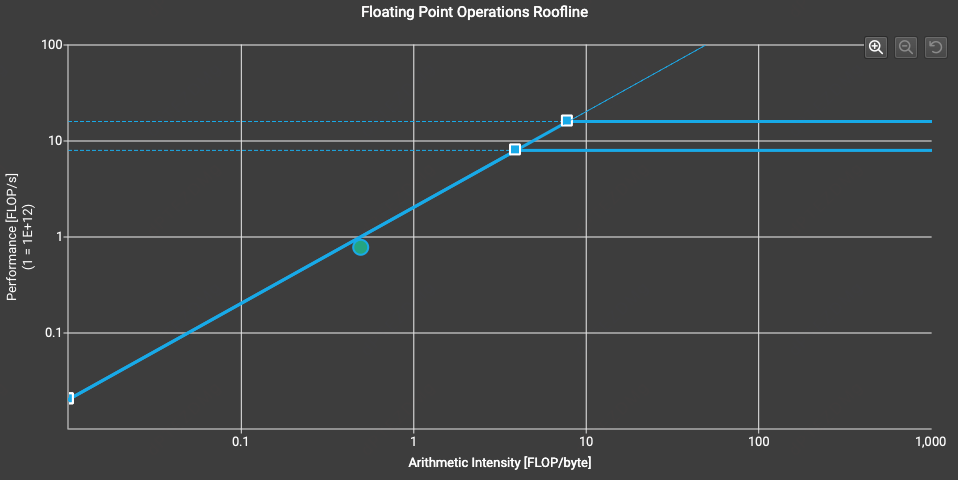
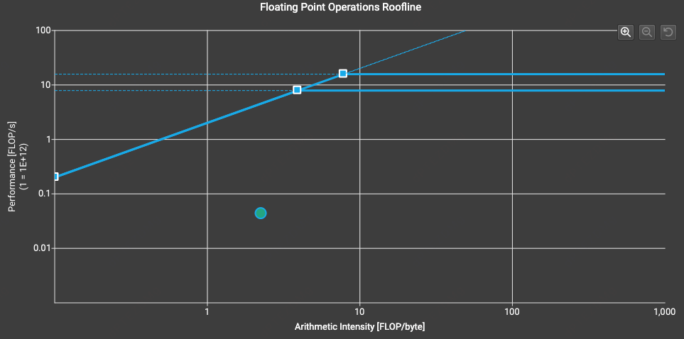

# NF4 反量化 CUDA 算子

## 项目简介

本项目实现了高效的 NF4（4-bit NormalFloat）反量化 CUDA 算子，将压缩后的 4-bit 权重实时解压为 16-bit 浮点（BF16/FP16）输出，用于加速大语言模型的推理过程。

NF4 是 QLoRA 论文中提出的一种量化格式，专门针对神经网络权重服从正态分布的特点进行优化。相比传统的均匀量化，NF4 采用分位数量化，在分布中心区域分配更多量化级别，在保持 4-bit 压缩率的同时提供更高的精度。

## 项目结构

```
03_nf4_dequant/
.
├── image/
├── README.md
├── run_test.sh
├── src
│   ├── iluvatar
│   │   └── kernel.cu
│   ├── metax
│   │   ├── include/
│   │   ├── kernel.maca
│   ├── moore
│   └── nvidia
│       └── kernel.cu
└── test_nf4_dequant.py
```

## NF4 量化格式

### 两级量化公式

```
output = nf4_lut[idx] * (code2[absmax_q] * absmax2[group] + offset)
```

- `nf4_lut[idx]`: NF4 查找表值
- `absmax_q`: 一级量化索引（每 block 一个）
- `code2[absmax_q]`: 一级反量化值
- `absmax2[group]`: 二级缩放因子（每 256 个 block 一个）
- `offset`: 量化偏移（通常为 0）

## 实现方案

### 1. Naive 版本 (`nf4_dequant_naive_kernel`)

**设计思路：**
- 每个线程处理 2 个元素（对应 1 个 packed uint8）
- 基础实现，关注功能正确性

**核心代码逻辑：**
```cpp
// 解包 NF4 索引
uint8_t packed = packed_weights[global_idx / 2];
uint8_t idx_even = (packed >> 4) & 0x0F;
uint8_t idx_odd = packed & 0x0F;
// 计算量化块索引
int64_t block_idx = global_idx >> log2_blocksize;
int64_t group_idx = block_idx >> 8;
// 双重解量化
float absmax = code2[absmax_q] * absmax2[group_idx] + offset;
output[global_idx] = nf4_lut[idx] * absmax;
```

**Roofline 分析：**



从 Roofline 分析图可以看出，绿点位于左侧斜坡下方，显著低于理论峰值，表明当前实现处于严重的访存受限状态，内存带宽利用率仍有较大提升空间，属于典型的**访存受限** 区域。

### 2. 向量化版本 (`nf4_dequant_vectorized_kernel`)

**设计思路：**
- 每个线程处理 8 个元素（读取 1 次 uint32_t，写入 1 次 uint4）
- 使用 Shared Memory 存储 LUT，避免 Constant Memory Bank 冲突

**关键优化点：**

| 优化项 | 实现方式 | 效果 |
|--------|---------|------|
| 向量化读取 | `uint32_t` 一次性读取 4 字节 | 减少 75% 读取指令 |
| Shared Memory LUT | `__shared__ float shared_lut[16]` | 避免 Constant Memory 串行化 |
| 向量化写入 | `uint4` 一次性写入 128-bit | 内存请求合并为 512 Bytes |
| Block 边界优化 | 缓存 `absmax` 值，跨 block 时重新计算 | 减少冗余计算 |

**访存合并分析：**
- 每个线程读取 4 字节（uint32_t）
- 一个 Warp（32线程）读取 128 Bytes
- 完美命中一次 L2 缓存行（Cache Line）

**Roofline 分析：**



算子现在已经贴在了内存带宽限制线上，从低效访存转变为满载访存。这表明当前访存模式已相当理想，基本达到了当前硬件的物理带宽极限。

但进一步分析发现，向量化版本仍存在冗余访问问题：当 32 个线程处于同一量化块时，每个线程都会独立读取该块的元数据（absmax_q、absmax2、code2），导致同一份数据被重复读取 32 次。根据 Nsight Compute 的优化建议：

> The memory access pattern for global loads from L1TEX might not be optimal. On average, only 15.4 of the 32 bytes transmitted per sector are utilized by each thread. This could possibly be caused by a stride between threads. Check the Source Counters section for uncoalesced global loads.

因此，通过 Warp 级协作减少元数据的冗余访问，仍有进一步优化空间。

### 3. 优化版本 (`nf4_dequant_optimized_kernel`)

**设计思路：**
- 在向量化的基础上引入 Warp 级协作
- 使用 `__shfl_sync` 广播元数据，减少全局内存访问

**核心优化策略：**

```cpp
// 1. 动态活跃掩码 - 避免死锁
uint32_t active_mask = __ballot_sync(0xffffffff, is_fast_path);

// 2. Warp 协作读取元数据
int leader_lane = (lane_id / threads_per_block) * threads_per_block;
if (is_leader) {
    // 只有领头线程读取 absmax 相关数据
    absmax_val_broadcast = code2[a_idx] * absmax2[group_idx] + offset;
}
// 广播给 Warp 内其他线程
absmax_val_broadcast = __shfl_sync(active_mask, absmax_val_broadcast, leader_lane);
```

**优化收益：**
- 减少全局内存访问次数（每个 block 只读一次元数据）
- 提高有效内存带宽利用率


### 动态 Block 大小选择

<table>
  <tr>
    <td></td>
    <td></td>
  </tr>
</table>

上图展示了 `nf4_dequant_vectorized_kernel` 在处理小矩阵（左）和大矩阵（右）时的 Roofline 分析对比。可以观察到，同一算子在不同数据规模下的性能表现差异显著：小矩阵更容易受限于并行度不足，而大矩阵则能更好地发挥内存带宽优势。为适配不同规模的数据，采用动态 block 大小策略：

```cpp
int threads = (total_elements < 10240) ? 64 : 256;
```


## 内存类型选择分析

| 内存类型 | 优势 | 劣势 | 适用场景 |
|---------|------|------|---------|
| **Constant Memory** | 广播机制快，有缓存 | Warp 内访问不同地址时串行化 | 所有线程访问同一地址 |
| **Shared Memory** | 并行访问不同 Bank，低延迟 | 需要显式管理，容量有限 (48KB/SM) | LUT 查找，线程访问不同索引 |
| **寄存器** | 最快，无延迟 | 资源珍贵，过多会降 Occupancy | 临时变量 |

**本项目选择：** 使用 Shared Memory 存储 NF4_LUT，因为每个线程访问的权重索引（0-15）几乎肯定不同，Constant Memory 会导致严重的串行化。

## 平台支持

- [x] **NVIDIA GPU**（默认支持，A100）
- [x] **沐曦 GPU**（国产平台，Metax）
- [x] **天数 GPU**（国产平台，Iluvatar）

## 编译与运行

### 快速开始

本项目提供了完整的自动化测试脚本 `run_test.sh`，集成了以下功能：
- 测试数据自动生成
- 算子功能正确性验证
- 性能基准测试
- NCU 性能分析


### 性能对比表

ROWS=43031
COLS=40279 时测试如下

| 版本 | 核函数执行时间 | 有效内存带宽 | 吞吐量 | 相比 bitsandbytes 加速比 |
|------|---------------|-------------|--------|------------------------|
| Naive | 12.617 ms | 345.59 GB/s | 137.369 G elements/s | 0.31x |
| Vectorized | 2.839 ms | 1536.08 GB/s | 610.587 G elements/s | 1.36x |
| Optimized | 2.835 ms | 1538.03 GB/s | 611.362 G elements/s | 1.36x |

### 详细测试数据

#### 1. Naive 版本

```
Output shape: (43031, 40279)
============================================================
Performance Results
============================================================
Custom kernel time:         12.617 ms
Effective memory bandwidth: 345.59 GB/s
Throughput:                 137.369 G elements/s
bitsandbytes time:          3.868 ms
Speedup vs bitsandbytes:    0.31x
============================================================

==================================================
Validation Results
==================================================
Mean Absolute Error (MAE):  0.000023
Relative Error:             0.000029
Max Absolute Error:         0.003906
Reference range:[-5.7695, 5.7695]
Output range:[-5.7695, 5.7695]
==================================================

✓ PASSED: MAE (0.000023) < threshold (0.01)
```

#### 2. Vectorized 版本

```
Output shape: (43031, 40279)
============================================================
Performance Results
============================================================
Custom kernel time:         2.839 ms
Effective memory bandwidth: 1536.08 GB/s
Throughput:                 610.587 G elements/s
bitsandbytes time:          3.865 ms
Speedup vs bitsandbytes:    1.36x
============================================================

==================================================
Validation Results
==================================================
Mean Absolute Error (MAE):  0.000023
Relative Error:             0.000029
Max Absolute Error:         0.003906
Reference range:[-5.7695, 5.7695]
Output range:[-5.7695, 5.7695]
==================================================

✓ PASSED: MAE (0.000023) < threshold (0.01)
```

#### 3. Optimized 版本

```
Output shape: (43031, 40279)
============================================================
Performance Results
============================================================
Custom kernel time:         2.835 ms
Effective memory bandwidth: 1538.03 GB/s
Throughput:                 611.362 G elements/s
bitsandbytes time:          3.866 ms
Speedup vs bitsandbytes:    1.36x
============================================================

==================================================
Validation Results
==================================================
Mean Absolute Error (MAE):  0.000023
Relative Error:             0.000029
Max Absolute Error:         0.003906
Reference range:[-5.7695, 5.7695]
Output range:[-5.7695, 5.7695]
==================================================

✓ PASSED: MAE (0.000023) < threshold (0.01)
```

### 性能分析

- **Naive 版本**：带宽利用率较低（345.59 GB/s），性能低于 bitsandbytes 参考实现（0.31x）
- **Vectorized 版本**：通过向量化优化，带宽提升至 1536.08 GB/s（约 4.4 倍提升），超过 bitsandbytes（1.36x）
- **Optimized 版本**：比 Vectorized 版本性能略高，元数据广播优化在该测试规模下收益有限
- **正确性验证**：三个版本 MAE 均为 0.000023，远低于阈值 0.01，验证通过

## 输入文件格式

### 权重数据文件（二进制）

```
[header]
num_rows: int64               # 权重矩阵行数
num_cols: int64               # 权重矩阵列数
blocksize: int32              # 块大小（通常为 64 或 128）

[data]
packed_weights: uint8[num_rows * num_cols / 2]   # 每字节存两个 4-bit 索引
absmax_q: uint8[num_blocks]                      # 一级量化缩放因子索引
absmax2: float16[num_groups]                     # 二级缩放因子
code2: float16[256]                              # 二级码表
offset: float32                                  # 量化偏移（通常为 0）
```

### 参数文件（文本）

```ini
blocksize = 64                 # 块大小，必须与数据文件一致
compute_type = "bf16"          # 输出数据类型：bf16 或 fp16
target_gpu = "T4"              # 目标 GPU 型号（影响优化策略）
```

## 正确性验证

输出与 bitsandbytes 库的 `dequantize_blockwise` 结果对比：
- 平均绝对误差（MAE）< 1e-2（相对范围）
- 支持任意形状矩阵（行数和列数无需对齐到块大小的整数倍）

## 代码特性

### 模板化设计

使用 C++ 模板支持 FP16 和 BF16 两种输出类型：

```cpp
template<typename T> struct TypeTraits {};
template<> struct TypeTraits<__half> { /* FP16 实现 */ };
template<> struct TypeTraits<__nv_bfloat16> { /* BF16 实现 */ };
```


### 边界处理

- Fast Path: 完整处理 8 个元素的线程，使用向量化读写
- Slow Path: 处理尾部不足 8 个元素的情况，使用标量访问

## 开发笔记

### 关键技术点

1. **4-bit 解包**: 每字节存储两个 4-bit 索引，通过位运算 `(packed >> 4) & 0x0F` 和 `packed & 0x0F` 提取
2. **两级缩放**: 支持 block-level（64/128 元素）和 group-level（256 个 block）两级量化参数
3. **边界处理**: 支持任意形状矩阵，正确处理最后一行的部分块
4. **死锁修复**: 使用 `__ballot_sync` 动态计算 `active_mask` 取代固定掩码 `0xffffffff`，确保 Warp 内协作安全

### 优化历程

1. **V1 - Naive**: 实现基础功能，验证正确性
2. **V2 - Vectorized**: 优化内存访问模式，引入 Shared Memory LUT
3. **V3 - Optimized**: 引入 Warp 协作机制，减少冗余元数据访问
4. **V4 - Multi-Platform**: 适配国产 GPU 平台（沐曦、天数）

## 参考资料

- [QLoRA: Efficient Finetuning of Quantized LLMs](https://arxiv.org/abs/2305.14314) - QLoRA 论文
- [bitsandbytes](https://github.com/TimDettmers/bitsandbytes) - 参考实现
- [CUDA C Programming Guide](https://docs.nvidia.com/cuda/cuda-c-programming-guide/) - CUDA 编程指南
- [CUDA Best Practices Guide](https://docs.nvidia.com/cuda/cuda-c-best-practices-guide/) - CUDA 最佳实践

## 作者

- 完成人：[valorix25]
- 完成日期：2025年
- 所属项目：InfiniTensor 训练营 2025 冬季项目
