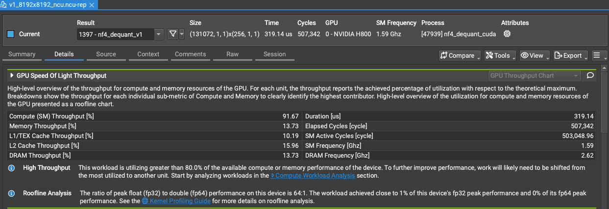
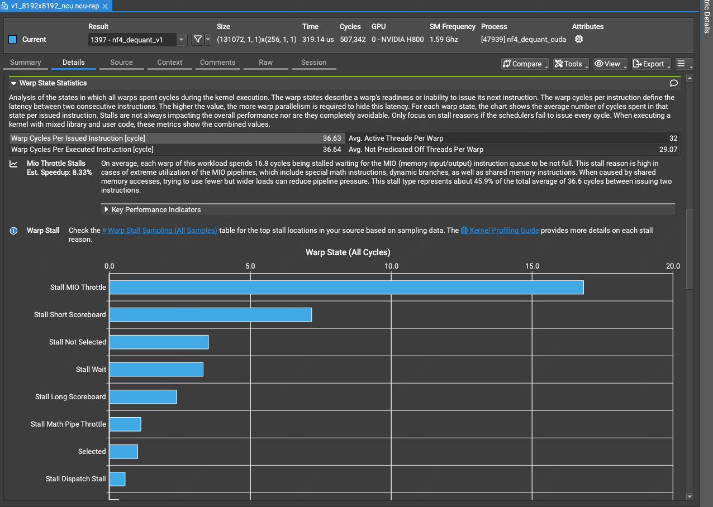
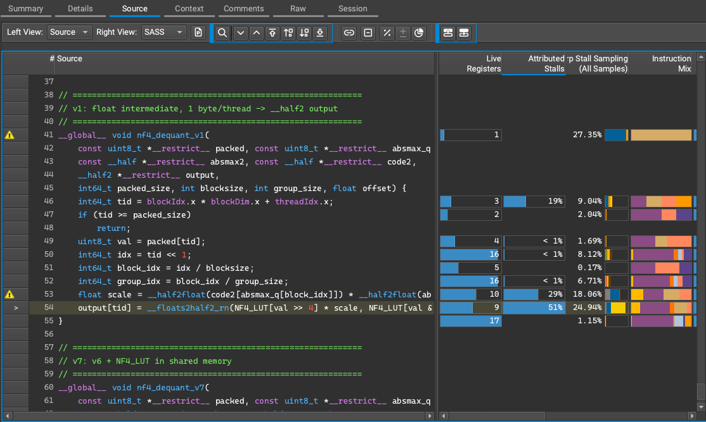
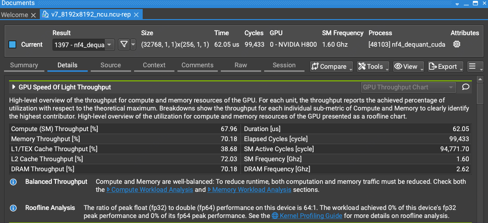
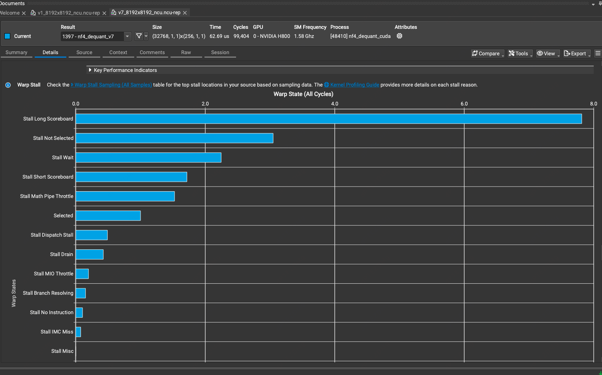

# NF4 反量化性能优化分析

## v1: 基础实现

### 实现要点
- 基础 NF4 反量化，实现两级缩放的解量化
- NF4_LUT 放入常量内存
- 使用 `float` 进行中间计算
- 每个线程处理 1 字节（2 个 4-bit 索引），计算 2 个 BF16 值后打包成 `__half2` 写入

### NCU 分析 (8192×8192)

#### 1. 整体吞吐
- **计算吞吐**: ~90%
- **内存吞吐**: ~10%

#### 2. Warp 状态分析

**主要瓶颈**: `Stall MIO Throttle` 占比最高
- MIO Throttle 通常意味着：访存指令密集、寄存器溢出、非合并访问、常量内存冲突

#### 3. 源码级热点分析

| 位置 | 采样占比 (Sampling) | 归属占比 (Attributed) | 主要问题与瓶颈分析 |
| :--- | :--- | :--- | :--- |
| **第 41 行** (Kernel 入口) | **27.35%** | -- | **启动与常量加载开销**：主要是内核启动及 `const` 参数从 Constant Cache 加载的延迟。 |
| **第 53 行** (`scale` 计算) | **18.06%** | **29%** | **访存延迟 (Memory Dependency)**：涉及到 `absmax_q` 和 `absmax2` 的全局内存非连续访问，引起长延时。 |
| **第 54 行** (数据写回) | **24.94%** | **51%** | **执行依赖 (Execution Dependency)**：这是最大的瓶颈。指令正在等待第 53 行生成的 `scale` 寄存器就绪，表现为大量的黄色/橘色条。 |

---

## v7: 优化版本

### 优化要点
- NF4_LUT 从常量内存移至 **Shared Memory**
- 每个线程处理 **4 字节**（8 个 NF4 值）
- 使用 `__half` 全程计算，减少类型转换
- 向量化读写：`uint4` 一次性写入 8 个 `__half`

### NCU 分析 (8192×8192)

#### 1. 整体吞吐

- **计算吞吐**: 67.96%
- **内存吞吐**: 70.18%
- **状态**: "Balanced Throughput" — 计算与内存更均衡

#### 2. Warp 状态对比

**改善明显**:
- `Stall MIO Throttle` 大幅下降
- `Stall Long Scoreboard` 成为主要瓶颈（内存延迟，正常）

---

## 性能对比

| 版本 | BnB (ms) | CUDA (ms) | Speedup |
|------|----------|-----------|---------|
| v1   | 0.0845   | 0.1693    | 4.73x   |
| v7   | 0.0846   | 0.0400    | **8.22x** |

### 优化收益总结

| 优化项 | 效果 |
|--------|------|
| Shared Memory LUT | 消除常量内存冲突，降低 MIO Throttle |
| 4字节/线程 | 提高指令级并行，摊平线程开销 |
| 全程 half 计算 | 减少 float↔half 转换开销 |
| uint4 向量化写 | 提升全局内存带宽利用率 |

---

## 关键结论

1. **v1 瓶颈**: 数据依赖链过长（`scale` 计算 → 查表 → 乘法），导致 Execution Dependency  stall
2. **v7 改进**: 通过 Shared Memory + 向量化，将瓶颈从计算依赖转移到内存延迟（更健康的瓶颈分布）
3. **进一步优化方向**:
   - 尝试更大的线程处理粒度（8字节/线程）
   - 预取 `absmax_q` 和 `absmax2` 到寄存器
   - 使用 `__half2` 向量化计算

